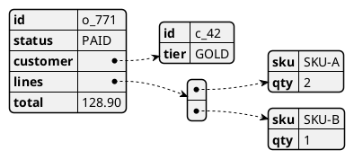

# JSON / YAML Diagrams

## Purpose

Render JSON or YAML data as a structured diagram. Useful for
documenting API response shapes, config formats, or domain examples
inline in specs.

## Choose this when / avoid when

- ✅ Embedding an API example or config sample in a doc
- ✅ Illustrating nested structures with obvious hierarchy
- ❌ Showing schemas/relations → use `er` or `class`
- ❌ Huge blobs: use an appendix or external file

## Detail-level presets

- `minimal`: one top-level key with a few children.
- `standard`: realistic example with 2–3 levels of nesting.
- `detailed`: highlight fields with `<#color>` for annotations;
  include comments.

## Layout tips

- `@startjson` / `@endjson` for JSON; `@startyaml` / `@endyaml` for
  YAML.
- Keep the example ≤ 30 lines; beyond that, point to an external
  file.

## Known limitations (PlantUML 1.2026.x)

Two parser quirks worth knowing about:

**1) Includes must be OUTSIDE `@startjson`.** The JSON parser treats
everything between `@startjson` and `@endjson` as JSON data — including
preprocessor directives like `!include`. Place the target/include chain
*before* `@startjson`:

```plantuml
!$target = %getenv("PLANTUML_TARGET")
!include .plantuml/_base.puml
!include .plantuml/_targets/$target.puml
@startjson JSON_OrderResponse
{ ... }
@endjson
```



If you put `!include` inside the `@startjson` block, both PNG and SVG
render the *"Your data does not sound like JSON data"* error stub.

**2) PNG render must NOT use `-S<setting>=...` CLI flags.** Any
`-Sscale`, `-SdefaultFontSize`, etc. on the command line forces the
JSON parser into a degraded path that emits the same error stub. SVG
rendering is unaffected by `-S`.

For PNG-target render of a JSON diagram:

```bash
plantuml -tpng diagram.puml          # OK
plantuml -tpng -Sscale=3 diagram.puml # BROKEN — produces error stub
```

If you need scale/dpi override, set `skinparam dpi <N>` inside the
include chain instead of the CLI flag. The `_targets/docx.puml`
template already does this.

## Snippet



## Common pitfalls

- Using JSON/YAML diagrams as data storage. Fix: it's for
  illustration; the authoritative schema lives elsewhere (OpenAPI,
  JSON Schema).
- Dropping commas/quotes and breaking the render. Fix: the snippet
  must be valid JSON/YAML; pass through a linter.
- Putting `!include` between `@startjson` and the JSON body. Fix:
  move includes *before* `@startjson`. See Known limitations above.
- Rendering JSON to PNG with `-Sscale=N` or other `-S` CLI flags.
  Fix: drop the flag, or render to SVG. See Known limitations.
